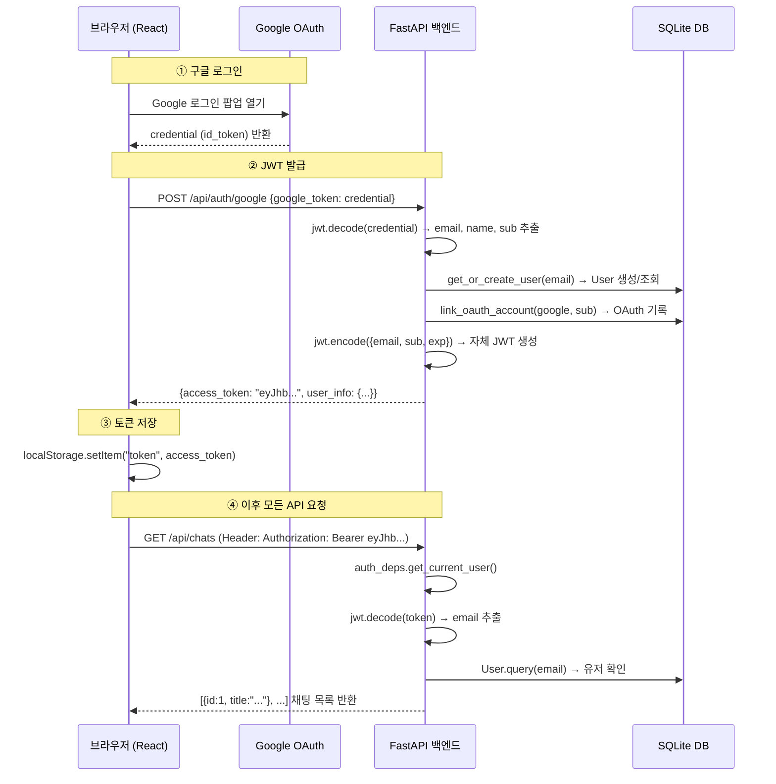

```mermaid
sequenceDiagram
    participant U as 브라우저 (React)
    participant G as Google OAuth
    participant B as FastAPI 백엔드
    participant DB as SQLite DB

    Note over U,G: ① 구글 로그인
    U->>G: Google 로그인 팝업 열기
    G-->>U: credential (id_token) 반환

    Note over U,B: ② JWT 발급
    U->>B: POST /api/auth/google {google_token: credential}
    B->>B: jwt.decode(credential) → email, name, sub 추출
    B->>DB: get_or_create_user(email) → User 생성/조회
    B->>DB: link_oauth_account(google, sub) → OAuth 기록
    B->>B: jwt.encode({email, sub, exp}) → 자체 JWT 생성
    B-->>U: {access_token: "eyJhb...", user_info: {...}}

    Note over U: ③ 토큰 저장
    U->>U: localStorage.setItem("token", access_token)

    Note over U,B: ④ 이후 모든 API 요청
    U->>B: GET /api/chats (Header: Authorization: Bearer eyJhb...)
    B->>B: auth_deps.get_current_user()
    B->>B: jwt.decode(token) → email 추출
    B->>DB: User.query(email) → 유저 확인
    B-->>U: [{id:1, title:"..."}, ...] 채팅 목록 반환
```