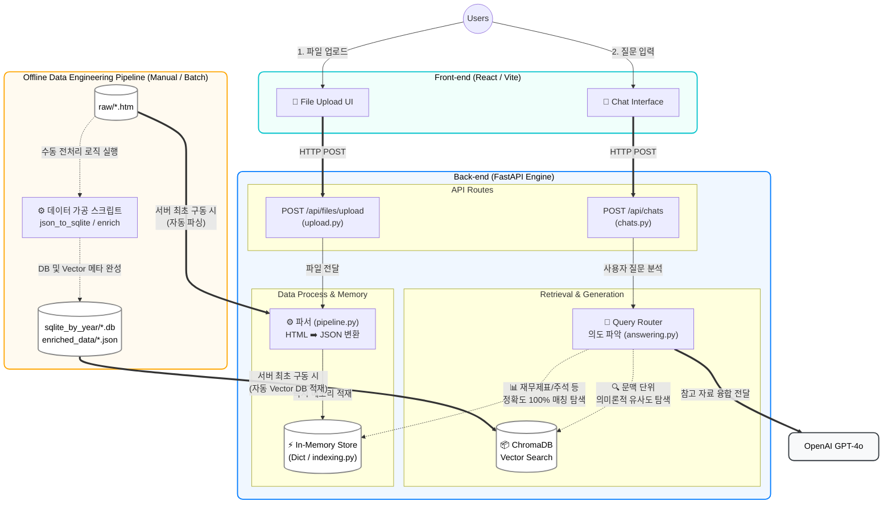

```mermaid
flowchart TB
    %% 색상 및 디자인 통일 (밝고 화사한 프리미엄 톤 적용)
    classDef frontend fill:#f0fffb,stroke:#00c2cb,stroke-width:2px,color:#000,rx:10px,ry:10px
    classDef backend fill:#f0f7ff,stroke:#007bff,stroke-width:2px,color:#000,rx:10px,ry:10px
    classDef offline fill:#fffaf0,stroke:#ffa500,stroke-width:2px,color:#000,rx:10px,ry:10px
    classDef db fill:#ffffff,stroke:#888,stroke-width:2px,color:#000,shape:cylinder
    classDef external fill:#f8f9fa,stroke:#343a40,stroke-width:2px,color:#000,rx:10px,ry:10px
    
    Users((Users))
    
    %% ==========================================
    %% 프론트엔드 공간
    %% ==========================================
    subgraph FrontEnd["Front-end (React / Vite)"]
        direction LR
        UI_Upload["📂 File Upload UI"]
        UI_Chat["💬 Chat Interface"]
    end
    FrontEnd:::frontend
    
    Users -->|"1. 파일 업로드"| UI_Upload
    Users -->|"2. 질문 입력"| UI_Chat
    
    %% ==========================================
    %% 백엔드 공간 (실시간/온라인)
    %% ==========================================
    subgraph BackEnd["Back-end (FastAPI Engine)"]
        direction TB
        
        subgraph Endpoints["API Routes"]
            direction LR
            API_Upload["POST /api/files/upload<br>(upload.py)"]
            API_Chat["POST /api/chats<br>(chats.py)"]
        end
        
        subgraph RealtimeProcess["Data Process & Memory"]
            Pipeline["⚙️ 파서 (pipeline.py)<br>HTML ➡️ JSON 변환"]
            MemoryStore[("⚡ In-Memory Store<br>(Dict / indexing.py)")]:::db
        end
        
        subgraph RAG["Retrieval & Generation"]
            Router["🧠 Query Router<br>의도 파악 (answering.py)"]
            ChromaStore[("📦 ChromaDB<br>Vector Search")]:::db
        end
        
        %% 내부 라우팅
        API_Upload -->|"파일 전달"| Pipeline
        Pipeline -->|"즉시 메모리 적재"| MemoryStore
        
        API_Chat -->|"사용자 질문 분석"| Router
        
        Router -.->|"📊 재무제표/주석 등<br>정확도 100% 매칭 탐색"| MemoryStore
        Router -.->|"🔍 문맥 단위<br>의미론적 유사도 탐색"| ChromaStore
    end
    BackEnd:::backend
    
    %% 외부 연결
    UI_Upload ==>|"HTTP POST"| API_Upload
    UI_Chat ==>|"HTTP POST"| API_Chat
    Router ==>|"참고 자료 융합 전달"| GPT["OpenAI GPT-4o"]:::external
    
    %% ==========================================
    %% 데이터 엔지니어링 파이프라인 (오프라인/수동)
    %% ==========================================
    subgraph Offline["Offline Data Engineering Pipeline (Manual / Batch)"]
        direction LR
        RawHTML[("raw/*.htm")]:::db 
        OfflineScripts["⚙️ 데이터 가공 스크립트<br>json_to_sqlite / enrich"] 
        ProcessedDB[("sqlite_by_year/*.db<br>enriched_data/*.json")]:::db
        
        RawHTML -.->|"수동 전처리 로직 실행"| OfflineScripts
        OfflineScripts -.->|"DB 및 Vector 메타 완성"| ProcessedDB
    end
    Offline:::offline
    
    %% ==========================================
    %% 생명주기 (Startup / 자동화)
    %% ==========================================
    RawHTML ==>|"서버 최초 구동 시<br>(자동 파싱)"| Pipeline
    ProcessedDB ==>|"서버 최초 구동 시<br>(자동 Vector DB 적재)"| ChromaStore
```